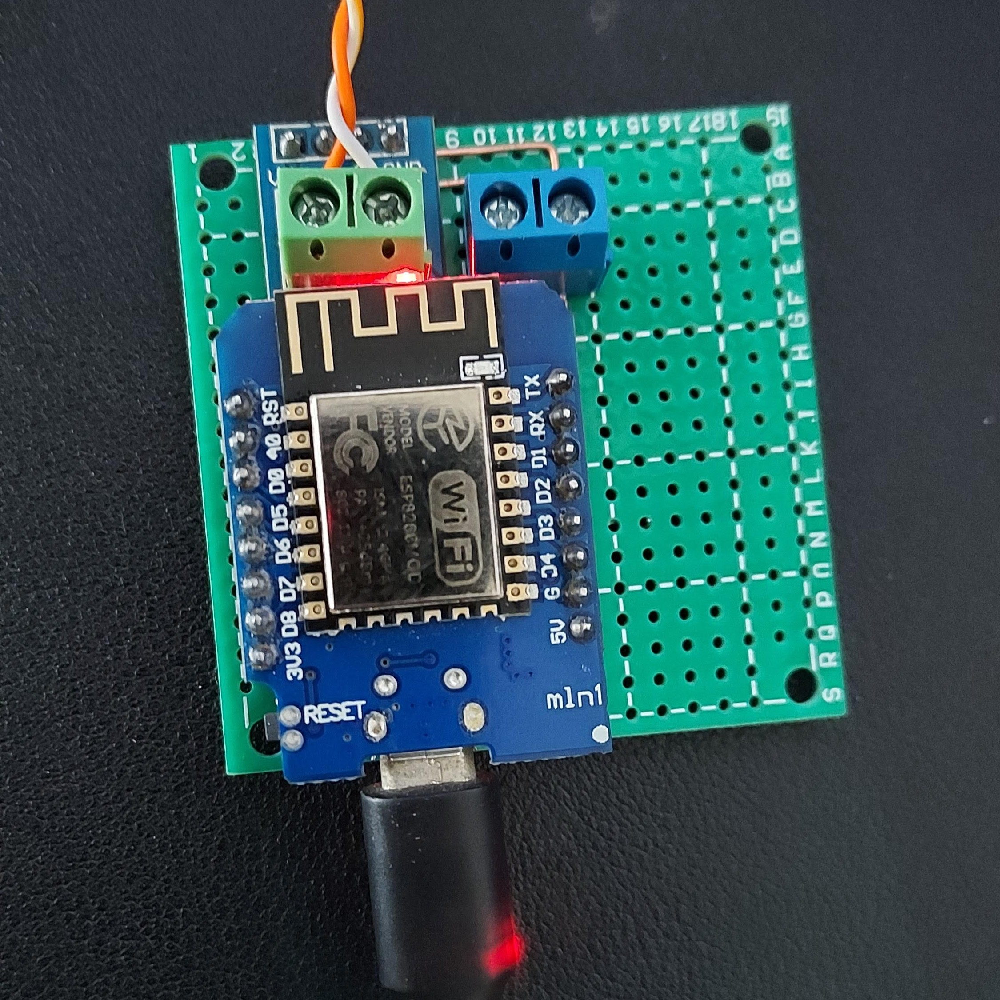

# 3300TL-G3-Monitor

โปรเจคนี้เป็นการรวมกันของ ESP8266 และ MAX485 เพื่อสร้างระบบที่สามารถอ่านค่าจากอินเวอร์เตอร์ SOFAR 3300TL-G3 และแสดงผลผ่าน Web UI แบบเรียลไทม์

## อุปกรณ์ที่จำเป็น

- ESP8266 module
- MAX485 module
- แหล่งจ่ายไฟ 5V

## รูปภาพ

## แผนภาพการเชื่อมต่อ

